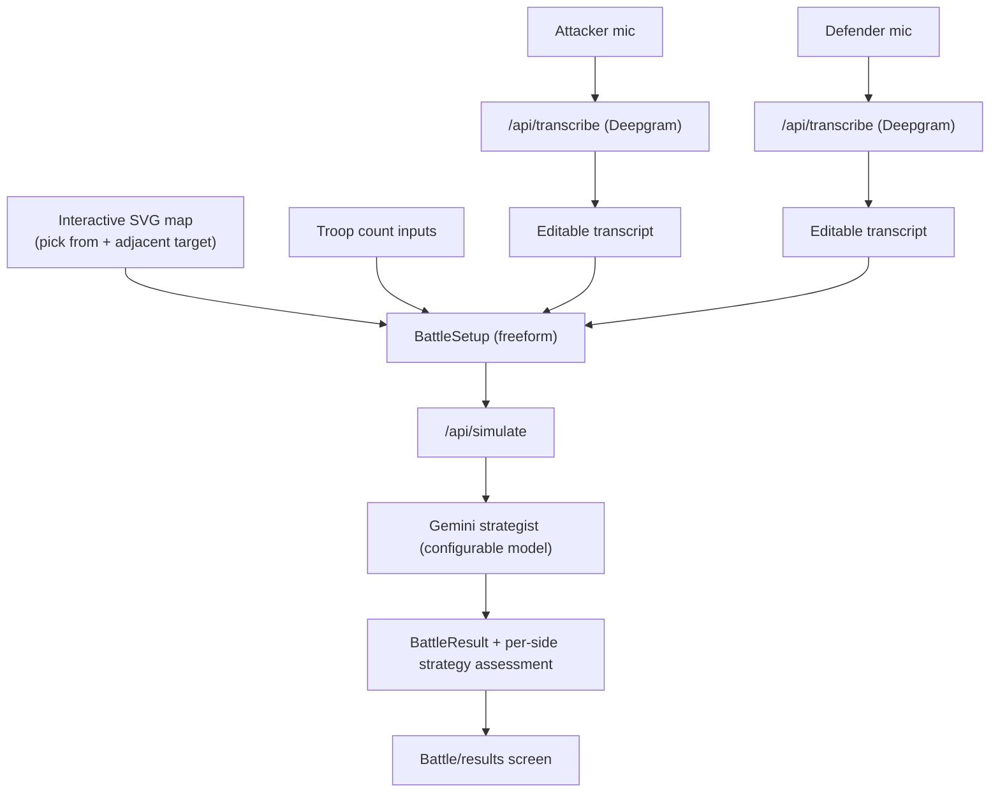

# Freeform Voice Strategy + Interactive Risk Map

## Decisions locked in
- Map: fully interactive clickable SVG board (attacker picks "attack from" + an adjacent "defend" territory).
- AI: Gemini, model configurable via env, default `gemini-3-flash-preview` (note: `gemini-2.5-flash` is reportedly EOL June 17, 2026).
- Both attacker and defender record a freeform strategy.
- Voice (Deepgram) primary, with an editable text transcript fallback.
- Mobile-first: the entire flow must be comfortable on a typical iPhone/Android (~360-430px wide), shipped as an installable PWA.

## Mobile-first / PWA requirements (applies to everything below)
- Target viewport ~360-430px wide first; design up to tablet/desktop, not down.
- Layout: single-column, vertical flow on phones; the existing `grid-cols-2` blocks in [src/app/battle/page.tsx](src/app/battle/page.tsx) must collapse to stacked (`grid-cols-1 sm:grid-cols-2`).
- Touch targets >= 44x44px (Apple HIG); large tap-friendly buttons for record/simulate.
- Map on phones: territories are small, so the map needs pinch-zoom + pan (e.g. `react-zoom-pan-pinch` or a viewBox-based pan) and a confirmation of the tapped territory by name, since precise taps are hard. Selected from/target also shown as text chips below the map.
- Respect iOS safe areas (`env(safe-area-inset-*)`) and avoid 100vh bugs (use `100dvh`).
- Inputs sized to avoid iOS zoom-on-focus (font-size >= 16px on inputs).
- PWA: add `manifest.json` (name, icons 192/512, `display: standalone`, theme/background color), apple-touch-icon + iOS meta in [src/app/layout.tsx](src/app/layout.tsx) (it already sets `maximumScale: 1, userScalable: false`). Service worker via `next-pwa` (or a minimal SW) for installability/offline shell; AI/transcription calls still require network.
- iOS mic note: `MediaRecorder`/`getUserMedia` works in iOS Safari 14.5+ but only over HTTPS and after a user gesture; record button must be an explicit tap. Verify audio mime (Safari may emit `audio/mp4` rather than `webm`) and pass it through to Deepgram.

## New data flow

## Key changes by area

### Types ([src/types/index.ts](src/types/index.ts), [src/types/strategies.ts](src/types/strategies.ts))
- `BattleSetup`: drop `attackerStrategy`/`defenderStrategy` as `Strategy` objects; add `attackerStrategyText: string` and `defenderStrategyText: string`. Keep `attacking/defendingTerritory`, troop counts, colors.
- `BattleResult`: add `attackerStrategyAssessment` / `defenderStrategyAssessment` strings; keep `winner`, casualties, `phases`, `battleNarrative`, `keyMoment`.
- Repurpose the 7 `Strategy` archetypes ([src/strategies/](src/strategies/index.ts)) as an internal knowledge base array fed into the prompt (name + tacticalDescription + historicalReference + counters), not user-selectable. Remove `strongAgainst`/`weakAgainst` numeric matchup usage.

### Map data (new `src/lib/map/territories.ts`)
- All 42 territories with `id`, `name`, `continent`, `adjacency: string[]`, optional `terrain` (for AI grounding), and continent bonus metadata. Use canonical Risk adjacency (incl. cross-continent links: Alaska-Kamchatka, Greenland-Iceland, Brazil-North Africa, Southern Europe-Egypt/East Africa/Middle East, Middle East-India/Afghanistan, Siam-Indonesia, etc.).
- Helpers: `getTerritory(id)`, `areAdjacent(a,b)`, `getAdjacent(id)`.

### Interactive SVG map (new `src/components/RiskMap.tsx`)
- Vendor an open-source Risk SVG (Wikimedia "Risk_board.svg" / `raddrick/risk-map-svg`), normalize element ids to our territory ids.
- Render inline; `onClick`/`onTouch` selects "attack from" first, then restricts/highlights only adjacent territories for the target; fill states for from (e.g. green), target (red), eligible (highlight), others (dim).
- Mobile is the primary case: pinch-zoom + pan, larger hit areas, and text chips/confirmation of the tapped territory name below the map since small territories are hard to tap precisely.

### Voice + transcription (new `src/components/StrategyRecorder.tsx`, new `src/app/api/transcribe/route.ts`)
- Client records via `MediaRecorder`, POSTs audio blob to `/api/transcribe`.
- Server route calls Deepgram pre-recorded Nova-3 (`@deepgram/sdk`, `DEEPGRAM_API_KEY` server-side) and returns transcript. Cheaper than streaming and fits record-then-send.
- Transcript drops into an editable textarea (the fallback / correction path). Two recorders: attacker and defender.

### AI engine (rewrite [src/engine/ai-client.ts](src/engine/ai-client.ts), trim [src/engine/matchups.ts](src/engine/matchups.ts))
- Swap OpenAI for `@google/genai`. Model from `process.env.GEMINI_MODEL || 'gemini-3-flash-preview'`.
- New system prompt: world-class military historian/strategist grounded in real campaigns (Roman legions, Cannae/Hannibal, Genghis Khan's Mongol tactics, Napoleonic, modern doctrine) that judges each side's spoken plan against troop ratio + geography/terrain + adjacency, then decides outcome. Include the archetype KB as reference.
- Use Gemini JSON mode / `responseSchema` for `winner`, `attackerCasualties`, `defenderCasualties`, `battlePhases[]`, `narrativeSummary`, `keyMoment`, `attackerStrategyAssessment`, `defenderStrategyAssessment`.
- Fix the zero-casualty validation bug (don't reject `0`).
- `matchups.ts`: remove id-based numeric modifiers (AI handles matchup reasoning); keep only if a light geography helper is useful.

### API + state ([src/app/api/simulate/route.ts](src/app/api/simulate/route.ts), [src/store/battleStore.ts](src/store/battleStore.ts))
- Update validation to new freeform `BattleSetup` (territories adjacent, troops >= mins, strategy text present).
- Store already generic; adjust types only.

### UI flow ([src/app/page.tsx](src/app/page.tsx), [src/app/battle/page.tsx](src/app/battle/page.tsx))
- Build the setup screen on `page.tsx`: map + troop inputs + two `StrategyRecorder`s + "Simulate" -> set store -> route to `/battle`. Single-column, thumb-reachable; consider a stepped flow (map -> troops -> strategies) so each step fits one phone screen.
- Update `battle/page.tsx` results to show per-side strategy assessment alongside narrative/phases; collapse `grid-cols-2` to stacked on phones.

### Config + deps ([src/lib/config/gameParams.ts](src/lib/config/gameParams.ts), [package.json](package.json), [.env.local.example](.env.local.example))
- `gameParams.ts`: replace `AI_MODEL: 'gpt-4o-mini'` with Gemini default + env override.
- Add deps: `@google/genai`, `@deepgram/sdk`, and a PWA helper (`next-pwa`) + a map pan/zoom lib (`react-zoom-pan-pinch`). Remove `openai` after migration.
- Fix `.env.local.example` (currently still lists `ANTHROPIC_API_KEY`): add `GEMINI_API_KEY`, `GEMINI_MODEL`, `DEEPGRAM_API_KEY`.

### PWA setup (new `public/manifest.json`, icons, [src/app/layout.tsx](src/app/layout.tsx), [next.config.js](next.config.js))
- Add `manifest.json` + 192/512 icons + apple-touch-icon; reference manifest and iOS meta from `layout.tsx`.
- Wire `next-pwa` (or minimal service worker) in `next.config.js` for installability and an offline app shell.

## Notes / risks
- Interactive SVG is the largest effort: sourcing + normalizing path ids to 42 territory ids, made harder by needing accurate small-territory taps on phones (mitigated by pinch-zoom/pan + name confirmation).
- Browser mic permissions + audio format must match what Deepgram accepts. iOS Safari may emit `audio/mp4` instead of `webm/opus`; detect and forward the actual mime type. HTTPS + user gesture required on iOS.
- Gemini preview model id may change; env-configurable mitigates this.
- `next-pwa` + service worker can interfere with Next.js dev/HMR; gate SW to production builds.
